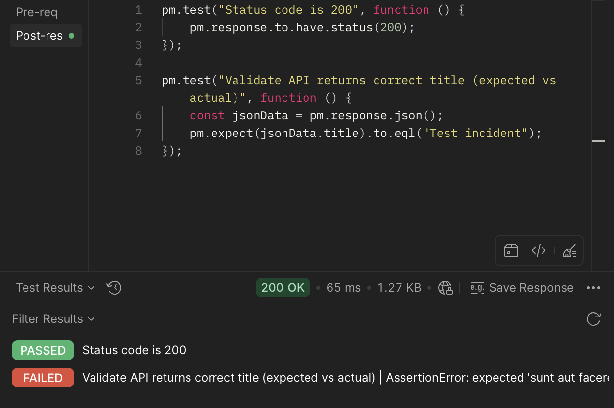

# support-engineer-lab

This project simulates real-world troubleshooting workflows used in technical support and integration roles.

This project demonstrates how I approach real-world technical support scenarios, including API troubleshooting, issue validation, and root cause analysis.

## 🔧 Tools Used
- Postman (API testing)
- HTTP/REST APIs
- SQL (data investigation)
- JSON response analysis

## 🧠 Skills Demonstrated
- API troubleshooting
- HTTP status code analysis (200, 404, etc.)
- Root cause analysis
- Writing validation tests in Postman
- Technical documentation

## 📂 Scenarios

### 1. Successful API Request
- Endpoint: GET /posts/1
- Validated correct response and status code (200 OK)

### 2. API 404 Error Investigation
- Endpoint: GET /invalid
- Identified incorrect endpoint usage
- Diagnosed 404 Not Found error
- Provided correct endpoint resolution

### 3. POST Request Validation
- Endpoint: POST /posts
- Validated response data using Postman test scripts
- Confirmed correct status code (201 Created)

 ### 4. SQL Data Mismatch Investigation
- Simulated investigation of incorrect application data
- Used SQL queries to validate records and check related data
- Documented likely root cause and escalation path

## Included Files
- `support-engineer-lab.postman_collection.json` — Postman collection
- `scenarios/` — real-world investigation notes
- `screenshots/` — Postman results

## Example Test Result

This example shows a successful API response (200 OK) with a failing validation test, indicating a mismatch between expected and actual data.

## Summary
This lab simulates real support engineer workflows:
- Investigating issues
- Validating system behavior
- Communicating root causes clearly
